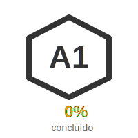
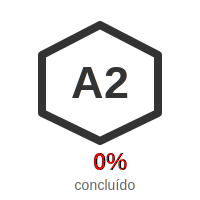
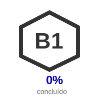
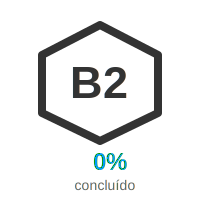
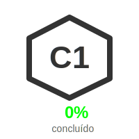

  
  <h1 style="text-align: center">Repositório de Estudos de Inglês</h1>
  

    Curso Online Completo da Kultivi - Estruturado por Níveis CEFR
  

---

<h3>Metodologia de Estudo</h3>

| Componente | Descrição | Duração Estimada |
|:---:|:---|:---:|
| 🎥 **Aulas em Vídeo** | Explicações gramaticais e diálogos contextualizados | ~45 min/aula |
| 📚 **Materiais de Apoio** | PDFs e exercícios disponíveis na plataforma Kultivi | Variável |
| 💬 **Prática de Conversação** | Vídeos interativos com tempo para repetição | ~30 min/aula |
| 📈 **Consistência** | "80% do aprendizado depende do aluno, 20% do professor" | Diária |

> **Dica de Estudo:** "The more you practice, the better you get." - Pratique diariamente, mesmo que por apenas 15-30 minutos.

---

<h3>Estrutura do Curso</h3>

| Nível CEFR | Módulos | Aulas | Tempo Estimado |
|:---:|:---:|:---:|:---:|
| **A1 - Iniciante** | 6 | 56 | ~42h:30m |
| **A2 - Elementar** | 4 | 50 | ~38h:15m |
| **B1 - Intermediário** | 5 | 56 | ~46h:00m |
| **B2 - Pós-Intermediário** | 7 | 49 | ~36h:30m |
| **C1 - Avançado** | 1 | 7 | ~6h:15m |
| **Total Geral** | **23** | **218** | **~169h:30m** |

---

<h3>Estrutura Detalhada do Curso</h3>

  

    
  

  

    <h3 style="text-align: center; margin-top: 0;">A1 - Iniciante</h3>
    <table>
      <tr>
        <th style="text-align: center;">Módulo</th>
        <th>Nome do Módulo</th>
        <th style="text-align: center;">Aulas</th>
        <th style="text-align: center;">Status</th>
      </tr>
      <tr>
        <td style="text-align: center;"><strong>01</strong></td>
        <td>O básico para a comunicação</td>
        <td style="text-align: center;">14</td>
        <td style="text-align: center;">✅ Em andamento</td>
      </tr>
      <tr>
        <td style="text-align: center;"><strong>02</strong></td>
        <td>Adjetivos e pronomes</td>
        <td style="text-align: center;">14</td>
        <td style="text-align: center;">⏳ Pendente</td>
      </tr>
      <tr>
        <td style="text-align: center;"><strong>03</strong></td>
        <td>Um pouco de vocabulário</td>
        <td style="text-align: center;">6</td>
        <td style="text-align: center;">⏳ Pendente</td>
      </tr>
      <tr>
        <td style="text-align: center;"><strong>04</strong></td>
        <td>Vamos dialogar?</td>
        <td style="text-align: center;">8</td>
        <td style="text-align: center;">⏳ Pendente</td>
      </tr>
      <tr>
        <td style="text-align: center;"><strong>05</strong></td>
        <td>Vamos falar sobre comida/roupas</td>
        <td style="text-align: center;">6</td>
        <td style="text-align: center;">⏳ Pendente</td>
      </tr>
      <tr>
        <td style="text-align: center;"><strong>06</strong></td>
        <td>Partes da casa</td>
        <td style="text-align: center;">11</td>
        <td style="text-align: center;">⏳ Pendente</td>
      </tr>
    </table>
  

  

    
  

  

    <h3 style="text-align: center; margin-top: 0;">A2 - Elementar</h3>
    <table>
      <tr>
        <th style="text-align: center;">Módulo</th>
        <th>Nome do Módulo</th>
        <th style="text-align: center;">Aulas</th>
        <th style="text-align: center;">Status</th>
      </tr>
      <tr>
        <td style="text-align: center;"><strong>07</strong></td>
        <td>Mais conversação</td>
        <td style="text-align: center;">4</td>
        <td style="text-align: center;">⏳ Pendente</td>
      </tr>
      <tr>
        <td style="text-align: center;"><strong>08</strong></td>
        <td>Móveis e objetos</td>
        <td style="text-align: center;">8</td>
        <td style="text-align: center;">⏳ Pendente</td>
      </tr>
      <tr>
        <td style="text-align: center;"><strong>09</strong></td>
        <td>Partes do corpo e mais</td>
        <td style="text-align: center;">13</td>
        <td style="text-align: center;">⏳ Pendente</td>
      </tr>
      <tr>
        <td style="text-align: center;"><strong>10</strong></td>
        <td>Comparativos e superlativos</td>
        <td style="text-align: center;">10</td>
        <td style="text-align: center;">⏳ Pendente</td>
      </tr>
    </table>
  

  

    
  

  

    <h3 style="text-align: center; margin-top: 0;">B1 - Intermediário</h3>
    <table>
      <tr>
        <th style="text-align: center;">Módulo</th>
        <th>Nome do Módulo</th>
        <th style="text-align: center;">Aulas</th>
        <th style="text-align: center;">Status</th>
      </tr>
      <tr>
        <td style="text-align: center;"><strong>11</strong></td>
        <td>Main Verbs</td>
        <td style="text-align: center;">10</td>
        <td style="text-align: center;">⏳ Pendente</td>
      </tr>
      <tr>
        <td style="text-align: center;"><strong>12</strong></td>
        <td>Um pouco mais de gramática</td>
        <td style="text-align: center;">8</td>
        <td style="text-align: center;">⏳ Pendente</td>
      </tr>
      <tr>
        <td style="text-align: center;"><strong>13</strong></td>
        <td>Vamos expandir vocabulário</td>
        <td style="text-align: center;">10</td>
        <td style="text-align: center;">⏳ Pendente</td>
      </tr>
      <tr>
        <td style="text-align: center;"><strong>14</strong></td>
        <td>Rotina</td>
        <td style="text-align: center;">4</td>
        <td style="text-align: center;">⏳ Pendente</td>
      </tr>
      <tr>
        <td style="text-align: center;"><strong>15</strong></td>
        <td>No hotel</td>
        <td style="text-align: center;">13</td>
        <td style="text-align: center;">⏳ Pendente</td>
      </tr>
    </table>
  

  

    
  

  

    <h3 style="text-align: center; margin-top: 0;">B2 - Pós-Intermediário</h3>
    <table>
      <tr>
        <th style="text-align: center;">Módulo</th>
        <th>Nome do Módulo</th>
        <th style="text-align: center;">Aulas</th>
        <th style="text-align: center;">Status</th>
      </tr>
      <tr>
        <td style="text-align: center;"><strong>16</strong></td>
        <td>Conversação aplicada</td>
        <td style="text-align: center;">16</td>
        <td style="text-align: center;">⏳ Pendente</td>
      </tr>
      <tr>
        <td style="text-align: center;"><strong>17</strong></td>
        <td>Irregular Verbs</td>
        <td style="text-align: center;">17</td>
        <td style="text-align: center;">⏳ Pendente</td>
      </tr>
      <tr>
        <td style="text-align: center;"><strong>18</strong></td>
        <td>Meios de transporte</td>
        <td style="text-align: center;">9</td>
        <td style="text-align: center;">⏳ Pendente</td>
      </tr>
      <tr>
        <td style="text-align: center;"><strong>19</strong></td>
        <td>To Do x To Make</td>
        <td style="text-align: center;">10</td>
        <td style="text-align: center;">⏳ Pendente</td>
      </tr>
      <tr>
        <td style="text-align: center;"><strong>20</strong></td>
        <td>To Take</td>
        <td style="text-align: center;">7</td>
        <td style="text-align: center;">⏳ Pendente</td>
      </tr>
      <tr>
        <td style="text-align: center;"><strong>21</strong></td>
        <td>To Get</td>
        <td style="text-align: center;">9</td>
        <td style="text-align: center;">⏳ Pendente</td>
      </tr>
      <tr>
        <td style="text-align: center;"><strong>22</strong></td>
        <td>To Look</td>
        <td style="text-align: center;">12</td>
        <td style="text-align: center;">⏳ Pendente</td>
      </tr>
    </table>
  

  

    
  

  

    <h3 style="text-align: center; margin-top: 0;">C1 - Avançado</h3>
    <table>
      <tr>
        <th style="text-align: center;">Módulo</th>
        <th>Nome do Módulo</th>
        <th style="text-align: center;">Aulas</th>
        <th style="text-align: center;">Status</th>
      </tr>
      <tr>
        <td style="text-align: center;"><strong>23</strong></td>
        <td>Diálogo viagem/férias</td>
        <td style="text-align: center;">7</td>
        <td style="text-align: center;">⏳ Pendente</td>
      </tr>
    </table>
  

---

<h3>Como Contribuir/Estudar</h3>
<h3>Guia Rápido para Novos Colaboradores</h3>

### Passo a Passo

1. **🔍 Escolha seu Nível de Início**
   - Consulte a tabela acima para identificar seu nível CEFR atual
   - Comece pelo módulo 1 caso seja iniciante completo

2. **📋 Acompanhe seu Progresso**
   - Acesse nosso [Plano de Estudos Detalhado](TODO.md)
   - Marque as aulas conforme as concluir
   - Utilize os status (✅ Em andamento / ⏳ Pendente / ✅ Concluído)

3. **🎥 Assista às Aulas**
   - **YouTube:** [Playlist Completa do Curso](https://www.youtube.com/playlist?list=PLvnDcR9zJ3ToYT9CcWdY3hNuBh4FY99J5)
   - **Plataforma Kultivi:** [Acesso ao Curso](https://app.kultivi.com/dashboard/course/ingles)

4. **📝 Pratique e Registre**
   - Crie anotações pessoais em arquivos Markdown
   - Compartilhe seu progresso nas issues do projeto
   - Participe das discussões e dúvidas

<h3>Melhores Práticas</h3>

| ✅ Faça | ❌ Evite |
|:---:|:---:|
| Estude diariamente | Deixar para acumular |
| Pratique speaking | Apenas ouvir passivamente |
| Revise conteúdos anteriores | Pular módulos |
| Tire dúvidas | Ficar com dúvidas |

---

<h3>📝 Plano de Estudos Detalhado</h3>

Para acompanhar todas as aulas, marcar progresso e ver detalhes de cada módulo, acesse nosso arquivo de controle:

---

_"Consistency is the key to fluency. Practice every day, even if just for a few minutes."_

